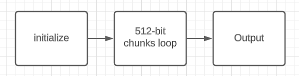
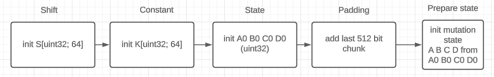

# MD5

The MD5 message-digest algorithm is a hash function producing a 128-bit hash value.
For more information checkout [wikipedia](https://en.wikipedia.org/wiki/MD5).

## Algorithm

### Nutshell

Algorithm can be split on three main parts:
1) Constants initialization and data preparation.
2) Loop of prepared_data to hash processing.
3) Returning result.



```rust
// Constants initialization
let k: [u32, 64] = init_k();
let s: [u32, 64] = init_s();
let (a0, b0, c0, d0) = init_state();
// Data preparation
// data = [chunk_1, chunk_2, ..., chunk_N]
// chunk.len() == 512 bits == 64 bytes == [u32; 16]
let data = add_last_chunk(data);
// loop by chunks
for chunk in data.iter() {
    let (mut a, mut b, mut c, mut d) = (a0, b0, c0, d0);
    // print_type_of(&word) == u32 chunk.len() == 16 words.
    for (i, word) in chunk.iter().enumerate() {
        let f = get_f(a, b, c, d, i);
        let g = get_g(i);

        let f = f + a + k[i] + word;
        a = d;
        d = c;
        c = b;
        b = b + f.left_rotate(s[i]);
    }
}
// return result
let (a0, b0, c0, d0) = (a0 + a, b0 + b, c0 + c, d0 + d);

return to_digest(a0, b0, c0, d0);
```

### More about initialization and data preparation



#### Constants

Constants k, s, a0, b0, c0, d0 is fixed:

```rust
let s: [u32; 64] = [
    7, 12, 17, 22,  7, 12, 17, 22,  7, 12, 17, 22,  7, 12, 17, 22,
    5,  9, 14, 20,  5,  9, 14, 20,  5,  9, 14, 20,  5,  9, 14, 20,
    4, 11, 16, 23,  4, 11, 16, 23,  4, 11, 16, 23,  4, 11, 16, 23,
    6, 10, 15, 21,  6, 10, 15, 21,  6, 10, 15, 21,  6, 10, 15, 21
];

let k: [u32; 64] = [
    0xd76aa478, 0xe8c7b756, 0x242070db, 0xc1bdceee,
    0xf57c0faf, 0x4787c62a, 0xa8304613, 0xfd469501,
    0x698098d8, 0x8b44f7af, 0xffff5bb1, 0x895cd7be,
    0x6b901122, 0xfd987193, 0xa679438e, 0x49b40821,
    0xf61e2562, 0xc040b340, 0x265e5a51, 0xe9b6c7aa,
    0xd62f105d, 0x02441453, 0xd8a1e681, 0xe7d3fbc8,
    0x21e1cde6, 0xc33707d6, 0xf4d50d87, 0x455a14ed,
    0xa9e3e905, 0xfcefa3f8, 0x676f02d9, 0x8d2a4c8a,
    0xfffa3942, 0x8771f681, 0x6d9d6122, 0xfde5380c,
    0xa4beea44, 0x4bdecfa9, 0xf6bb4b60, 0xbebfbc70,
    0x289b7ec6, 0xeaa127fa, 0xd4ef3085, 0x04881d05,
    0xd9d4d039, 0xe6db99e5, 0x1fa27cf8, 0xc4ac5665,
    0xf4292244, 0x432aff97, 0xab9423a7, 0xfc93a039,
    0x655b59c3, 0x8f0ccc92, 0xffeff47d, 0x85845dd1,
    0x6fa87e4f, 0xfe2ce6e0, 0xa3014314, 0x4e0811a1,
    0xf7537e82, 0xbd3af235, 0x2ad7d2bb, 0xeb86d391
];

let (a0, b0, c0, d0) = (
    0x67452301,
    0xefcdab89,
    0x98badcfe,
    0x10325476
);

```

#### Data preparation

First of all, you need to change input data only in last 512 chunk.
So if data is greater than 512 length, you can start hash calculation in loop before you get whole data.

For example, if you read some file with length 5000 bytes to hash it, then you don't really need immediately
read whole file. It's okay to read the file to some not so large buffer, for example 1024 bytes,
process buffer by 512 bits chunks, and go reading further (drop previous data in read buffer).
And only in the end of the file you need to do some data manipulation to "prepare" the data, you need to create 
last chunk(s) by special rules (check below).

```rust
// imaging some file: [u8; 50000] in you OS

const BUFF_LEN: usize = 1024;

// read buffer
let mut buffer = [0u8; BUFF_LEN];
// some state of md5 hash calculation, that changes by chunks consuming.
let mut state = md5::init_state();

let mut cnt: usize = 0;
let mut last = false;
while !last {
    let reads = file.read(&mut buffer).unwrape();
    cnt += 1;
    let chunks = buffer.split_by_chunks();

    // if last file read
    if reads != BUFF_LEN {
        // calculate total data length
        let total_len = calculate_total_len(cnt, reads, BUFF_LEN);
        // add last chunks to data.
        chunks.push_back(
            create_last_chunks(&buffer, total_len),
        );
        // finish loop
        last = true;
    }

    for chunk in chunks {
        // change state according to new chunk
        state = state.consume(chunk);
    }
}

let hash = state.to_hash();
```

#### Special rules of last chunk(s) creation.

Last chunk(s) can be 1 or 2.

For create last chunk(s) you need to have total length of hashing data and
last bits of the data `last_part.len() = total_length mod 512`.

**Algorithm rules for creation of last chunk(s)**:

Input: total_length = data.len(); last_part = data.chunk_tail();

Step 1: Append a single 1 bit to `last_part`.
Step 2: Append 0 bits to `last_part` until `last_part.len() mod 512 == 448`. So here could appear second last chunk,
be careful. Notice in the last last chunk remain 512 - 448 = 64 free bits.
Step 3: Append `total_length mod 2^64` to `last_part`, so here 64 free bits is filling.

**First two steps of the algorithm in a simpler way**

Work with bits is not convenient and unnecessary when you work with files (which are readings by bytes).
So you can do a trick: append `0x80` byte which is `0b10000000` bits representation.

```rust
// Notice first byte
const PADDING: [u8; 64] = [
    0x80, 0x00, 0x00, 0x00, 0x00, 0x00, 0x00, 0x00, 0x00, 0x00, 0x00, 0x00, 0x00, 0x00, 0x00, 0x00,
    0x00, 0x00, 0x00, 0x00, 0x00, 0x00, 0x00, 0x00, 0x00, 0x00, 0x00, 0x00, 0x00, 0x00, 0x00, 0x00,
    0x00, 0x00, 0x00, 0x00, 0x00, 0x00, 0x00, 0x00, 0x00, 0x00, 0x00, 0x00, 0x00, 0x00, 0x00, 0x00,
    0x00, 0x00, 0x00, 0x00, 0x00, 0x00, 0x00, 0x00, 0x00, 0x00, 0x00, 0x00, 0x00, 0x00, 0x00, 0x00,
];

// step 1 + step 2
let k = calculate_padding_bytes_len(&last_part)
last_part = last_part.join(PADDING[..k])
// step 3
last_part = last_part.join(total_length as u64);

let chunks = last_part.split_by_chunks();
```

After adding last chunk(s), we have data divided by N 512-bits chunks which are serial processed in the loop to get md5 hash.
 
### More about loop

#### Before the loop

Before loop starts we initialize state values (which are depend on previous iterations) a, b, c, d:
```rust
let mut a_s: u32 = a0;
let mut b_s: u32 = b0;
let mut c_s: u32 = c0;
let mut d_s: u32 = d0;
```

#### For each chunk in loop we do:

1) Split chunk into 32-bits words:
```rust
let words: [u32; 16] = chunk.split_words();
```
2) Initialize temp variable which are needed for state values calculation
```rust
let mut a_temp: u32 = a_s;
let mut b_temp: u32 = b_s;
let mut c_temp: u32 = c_s;
let mut d_temp: u32 = d_s;

let mut f_temp: u32 = 0;
let mut g_temp: u32 = 0;
```
3) Mutate by special rules temp variables: 
```rust
// remember that init values k and s is [u32; 64] arrays
for i in 0..64 {
    match i {
        0..16 => {
            f_temp = (b_temp & c_temp) | ((!b_temp) & d_temp);
            g_temp = i;
        }
        16..32 => {
            f_temp = (d_temp & b_temp) | ((!d_temp) & c_temp);
            g_temp = (5 * i + 1) % 16;
        }
        32..48 => {
            f_temp = b_temp ^ c_temp ^ d_temp
            g_temp = (3 * i + 5) % 16;
        }
        48..64 => {
            f_temp = c_temp ^ (b_temp | (!d_temp))
            g_temp = (7 * i) % 16;
        }
    }

    f_temp += a_temp + k[i] + words[g];
    a_temp = d_temp;
    d_temp = c_temp;
    c_temp = b_temp;
    b_temp += left_rotate(f_temp, s[i]);
}
```
4) After mutation of temp value, there are mutation of state variables:
```rust
a_s += a_temp;
b_s += b_temp;
c_s += c_temp;
d_s += d_temp;
```

#### After the loop

All information we need to create a md5 hash is `a_s, b_s, c_s, d_s`.


### More about finale hash creation

Hash, or digest of the data is:
```rust
let digest: [u8; 16] = join_split_by_bytes(a_s, b_s, c_s, d_s);
```

For print it:
```rust
print("{}", to_hex_str(digest))
```
